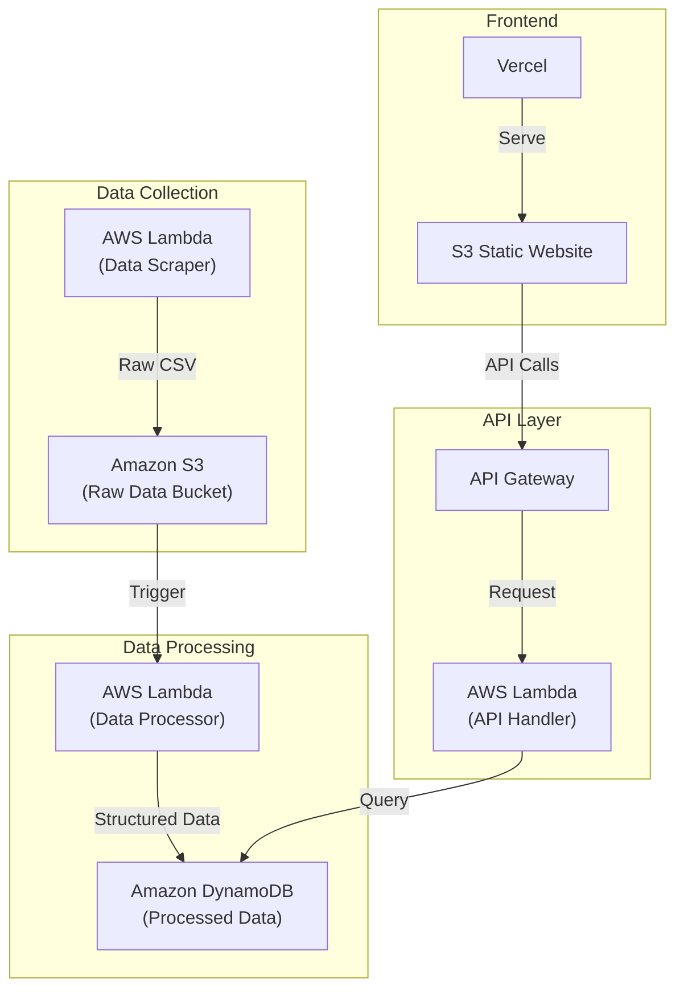

* icemap

we strongly believe that the American people should have full insight into the actions of its democratically-elected government.

icemap.dev aims to educate the American people on the activities and injustices of America's Immigration Customs Agency (ICE),
with specific focus on its Enforcement and Removal Operations department (ERO).

icemap aggregates both unstructured and structured data from a multitude of sources, consolidating this signal into useful
information for the American people.

icemap does not aim to hinder operations nor spark fear, but instead provide a lens with which the American people can
observe.

our realization is that transparency, not abstract political messaging, will best inform the American public.

in line with our principles of transparency, icemap is fully open-source and available under the MIT license.

todo:

- scraper currently store information locally in csv files. adapt the programs to instead make api requests to progressively update a live database. use aws lambda to ensure that the pipeline is robust, live, w/o wasted compute and time. verifies "new" articles against the existing database.
- use deepseek to interpret and best structure textual data
- frontend

### frontend:

we hope to construct one big, beautiful, minimalist map that usefully involves the wealth of data we've aggregated thus far.

to properly generate a runway to involve our data in this map, we plan to start to involve the data in the following order

1) bed capacity data
   * harvested from FOIA requests
   * has detention center location, but not necessarily with the same name. need to use deepseek to merge on the detention center database
   * changes over time, but unsure how to include temporal information thus far
   * use a simple heat map ranging from yellow to red, where the centers with high bed counts are very dark
   * can zoom in, at which point the detention center shows up, and then clicking on this center reveals the bed information
   * 
2) active case data
   * involve three dimensions?
3) newsroom event data
4) dhs press report data

For including changing time data:

- add a slider at the bottom that tracks from some reasonable time starting point to current day
- dynamically animates with data from that specific point in time
- changes to show new hotspots, enforcement, arrests, newsroom posts
- includes a "play" button that plays an animation of the changing landscape over time
- has "points" flash that show clickable incidents (mass arrests, etc)

assorted details:

- light mode & dark mode
- not super clunky or difficult to navigate
- user can't leave the US

#### implementation:

- map scene (Kepler.gl mounted inside a ResizablePanel)
- three layers: HeatMapLayer, IconLayer (arrest incidents, busts, etc), ScatterplotLayer (detention facilities, possibly)
- 

### backend:

IMPORTANT (remember this for tomorrow Jack): start using MediaCloud's API for obtaining present & past local news articles on ICE raids around the coutnry.

- robust pipeline for automatic data transmission (site updates -> html retrieval, parsing -> data processing -> shown on frontend)
- though data is currently stored in local csv files, the python scripts should run on a schedule (AWS Lambda, EventBridge), make api calls to update some database, and then the frontend should be connected to this database with some sort of api connection to update the data it uses
- need to learn what this pipeline looks like in reality. should study the writings of hft people

**Proposed AWS-based Architecture:**

## pipeline:

- AppSync + GraphQL or API Gateway + REST/JSON
- React Query for information caching
- etc
